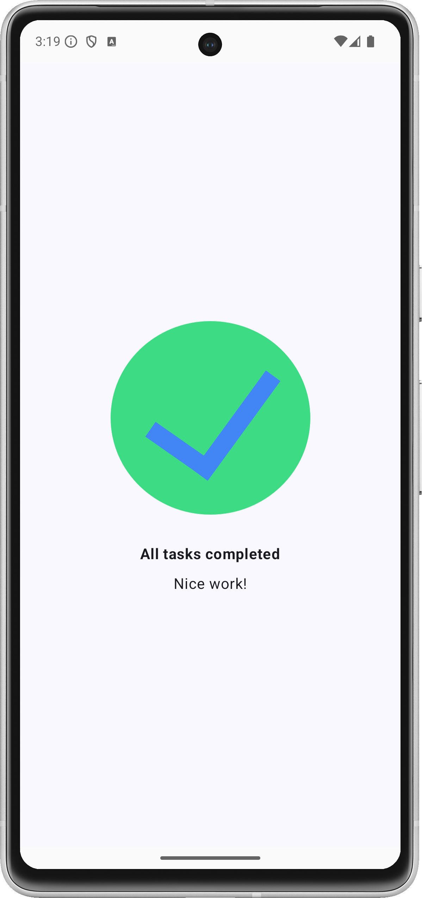

# Android Basics Compose Course - Unit 1

### Practice problem - Compose Task Completed
Build a screen for a Task Manager app which displays an 'All tasks completed' screen.  
Users would expect to see this screen when they complete all the tasks on a given day.

## Screenshot
